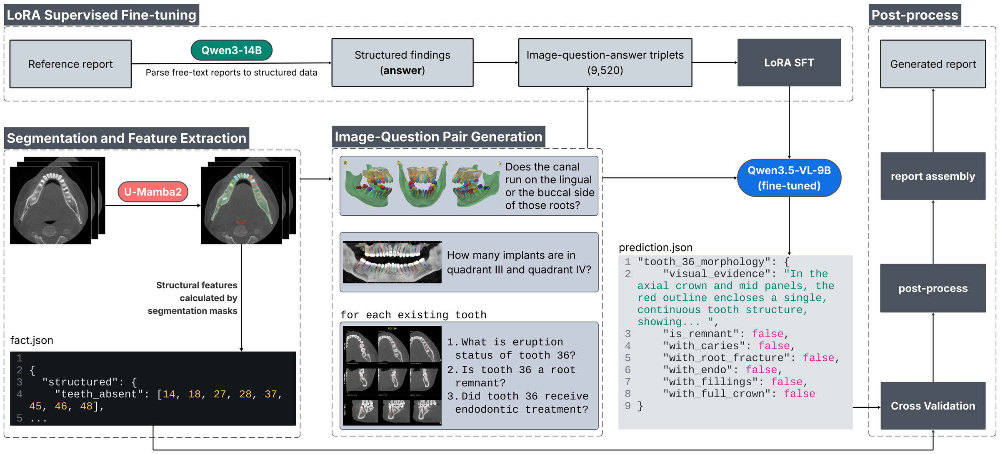

# V2V2R — From Voxels to Views to Reports

From Voxels to Views to Reports (V2V2R): A Segmentation-Guided VLM Pipeline for
CBCT Report Generation, built for the **ODIN2026 / ToothFairy4** challenge.



The main inference pipeline:


- **[multiclass segmentation]** dental CBCT volume -> segmentation mask + segmentation-derived facts
- **[image–question pair generation]** anatomy-aware renders → image generation + schema ⇒ image–question pairs
- **[VQA inference]** LoRA fine-tuned vision-language model answers a fixed clinical schema
- **[Post-process]** rule-based postprocess + template-based report generation


## Data

Not included. Get the volumes and reference reports from
[ToothFairy4 challenge](https://ditto.ing.unimore.it/toothfairy4/#download).

**Data layout:**

```
dataset/{training,validate}/
  images/   {case}_0000.nii.gz
  masks/    {case}.nii.gz
  reports/  {case}_1.txt, {case}_2.txt, ...   (a case may have several reports)
  facts/    {case}.json
```


## Model

The fine-tuned checkpoint is
[lucent517/v2v2r_cbct_vqa](https://huggingface.co/lucent517/v2v2r_cbct_vqa) —
LoRA SFT on `Qwen3.5-9B`, merged into the AWQ checkpoint. Fetch it into `models/`:

```bash
hf download lucent517/v2v2r_cbct_vqa \
    --local-dir models/Qwen3.5-9B-AWQ-dental-cbct-sft
```

or, equivalently, from Python:

```python
from huggingface_hub import snapshot_download

snapshot_download(
    repo_id="lucent517/v2v2r_cbct_vqa",
    local_dir="models/Qwen3.5-9B-AWQ-dental-cbct-sft",
)
```


## Run it

Inference is one entry point with three stages, split because they want
different hardware:

```bash
STAGE=images sbatch scripts/run_infer.sh validate   # CPU partition, no GPU held
STAGE=infer  sbatch scripts/run_infer.sh validate   # the only GPU stage
STAGE=post         scripts/run_infer.sh  validate   # login node, seconds/case
STAGE=all    sbatch scripts/run_infer.sh validate   # one job, one case
```

Common overrides: `MODEL_NAME`, `RUN_NAME`, `OUT_DIR`, `GT_DIR`,
`CASE_ID` / `CASE_IDS` / `LIMIT`, `RESUME=1`, and
`POSTPROCESS_CONFIG=configs/postprocess/no_source_rules.yaml`.

Or call the Python directly — one case, files named explicitly:

```bash
python code/pipeline/infer.py \
    --case-id A008 \
    --volume  dataset/validate/images/A008_0000.nii.gz \
    --mask    dataset/validate/masks/A008.nii.gz \
    --facts-file dataset/validate/facts/A008.json \
    --model   models/Qwen3.5-9B-AWQ-dental-cbct-sft \
    --out-dir outputs/one_case
```

It starts vLLM first and renders while the model loads, then prints where the
time went, phase by phase.


## Train it

LoRA SFT on the vision tower, the vision–language merger and the language
model's attention projections (`ARM=vision+language`) of bf16 `Qwen3.5-9B`, over
9,520 image–question–answer triplets. One stage per submission,
because they want different cards:

```bash
STAGE=pool                 scripts/run_sft.sh   # case lists; not optional
STAGE=targets              scripts/run_sft.sh   # sft_wide.jsonl
STAGE=parity  sbatch ...   scripts/run_sft.sh   # token-id equality gate
STAGE=train   ARM=vision+language EPOCHS=2 sbatch ... scripts/run_sft.sh
STAGE=merge   sbatch ...   scripts/run_sft.sh   # adapter -> servable AWQ
```

`STAGE=parity` is the acceptance test that matters: it asserts the training path
and the serving path produce **token-id-identical** prompts. Break that and the
model is fine-tuned for a prompt it will never see.

`STAGE=merge` writes a checkpoint of the same shape as the released one, so a
model trained here is served by the commands in [Run it](#run-it) unchanged.


## Environment and hardware

```bash
conda env create -f env/environment.yml     # cbct_base; pulls requirements.txt
conda activate cbct_base
python -m nltk.downloader wordnet omw-1.4   # DATA, not a pip package
```

**The third line is not optional if you intend to compare scores.** METEOR is
half the captioning score, and without `wordnet` the ranking silently falls back
to a lite implementation on a different scale. It warns and records
`meteor_backend` in `summary.json` either way; every score reported for this
work is `"nltk-wordnet"`.

`cbct_base` runs the whole CPU path and the inference *client* — no GPU, no
torch — which is what makes the postprocess loop usable on a laptop. The
container is the vLLM **server**, and by spec the training stack as well:
`env/container_requirements.txt`. Nothing in the pipeline imports vLLM;
`run_vqa_inference.py` is an HTTP client sending OpenAI-standard
`response_format`, so the two halves only ever have to agree over a socket. That
file is **a spec, not a built image** — verify a first build rather than
trusting it.

`radfact-lite` is pinned to a git SHA, not a PyPI version, and the pin is
load-bearing: PyPI's 0.1.0 predates a rewrite of the TOOTHFAIRY prompts, so
`pip install radfact-lite` gives a score not comparable with any number here.


## License

MIT, for the code — see [LICENSE](LICENSE). Challenge data and upstream model
weights carry their own terms and are not redistributed here.
